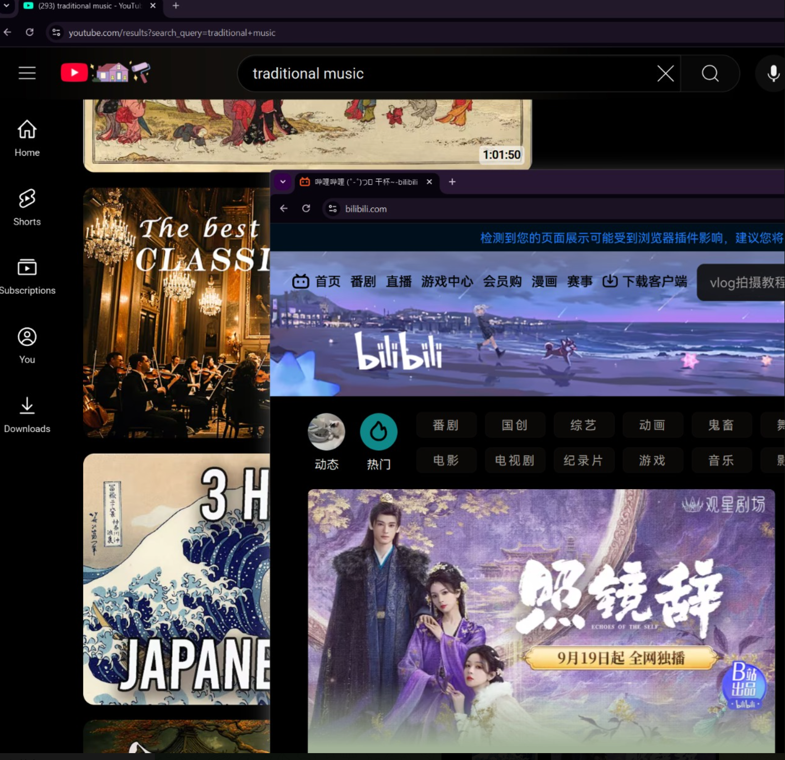

# Media Color Invert

A browser userscript that inverts colors of images and videos on web pages using Alt+i hotkey. Perfect for night browsing and reducing eye strain.

## Features

- **Quick Toggle**: Press Alt+i to instantly invert colors of all media elements on the page
- **Smart Inversion**: Inverts images and videos while maintaining correct colors for other elements
- **Persistent Settings**: Remembers your preference per website
- **Lightweight**: Minimal performance impact with debounced scanning
- **Universal Compatibility**: Works on all websites

## Installation

1. Install a userscript manager extension:
   - [Tampermonkey](https://www.tampermonkey.net/) (Chrome, Firefox, Safari, Edge)
   - [Greasemonkey](https://www.greasespot.net/) (Firefox)
   - [Violentmonkey](https://violentmonkey.github.io/) (Chrome, Firefox, Edge)

2. Install the script:
   - Click [here to install](https://github.com/snomiao/media-color-invert/raw/main/media-color-invert.user.js)
   - Or manually copy the script from `media-color-invert.user.js`

## Usage

- **Toggle Inversion**: Press `Alt + i` on any webpage
- The setting is saved automatically and will be remembered when you revisit the page
- Works great in combination with Windows' built-in color inversion (`Ctrl + Windows + C`) for a complete dark mode experience

## How It Works

The script applies CSS filters to invert the colors of media elements:
- Images and videos are inverted using `filter: invert(1)`
- The page gets a complementary `hue-rotate(180deg)` to maintain color relationships
- SVG elements are handled separately to preserve their appearance

## Support

- [Report Issues](https://github.com/snomiao/media-color-invert/issues)
- [Donate](https://snomiao.com/donate)

## License

MIT License - See [LICENSE](LICENSE) file for details